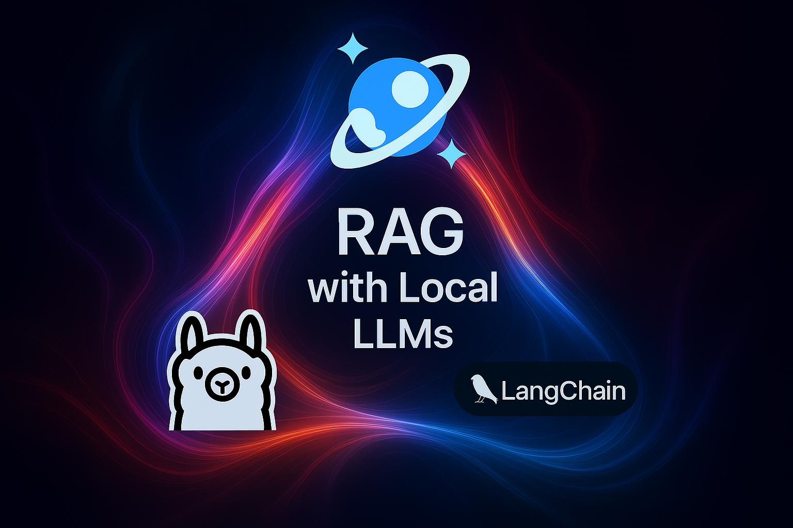

# Build a RAG application with LangChain and Local LLMs powered by Ollama

**... and Azure Cosmos DB as the Vector Database**

For a step-by-step guide, check out the full blog post at TODO. By the end of it, you will have a working local RAG setup that leverages Ollama and Azure Cosmos DB. the sample app uses [LangChain integration with Azure Cosmos DB](https://learn.microsoft.com/en-us/azure/cosmos-db/gen-ai/integrations?context=%2Fazure%2Fcosmos-db%2Fnosql%2Fcontext%2Fcontext) to perform embedding, data loading, and vector search. You can easily adapt it to other frameworks like LlamaIndex.

The blog post will illustrate how to use local LLMs with [Azure Cosmos DB as a vector database](https://learn.microsoft.com/en-us/azure/cosmos-db/gen-ai/why-cosmos-ai) for retrieval-augmented generation (RAG) scenarios. It will guide you through setting up a local LLM solution, configuring Azure Cosmos DB, loading data, performing vector searches, and executing RAG queries. You can either use the [Azure Cosmos DB emulator](https://learn.microsoft.com/en-us/azure/cosmos-db/emulator) for local development or connecting to an Azure Cosmos DB account in the cloud. You will be using Ollama (open-source solution) to run LLMs locally on your own machine. It lets you download, run, and interact with a variety of LLMs (like Llama 3, Mistral, and others) using simple commands, without needing cloud access or complex setup.